# Capturas de pantalla

## Dashboard principal

Vista general del panel de administración con métricas y accesos rápidos.

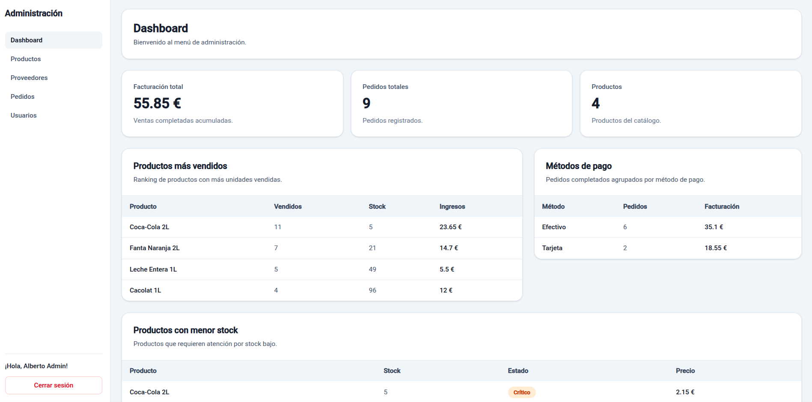

---

## Gestión de productos

Listado de productos registrados en el sistema.

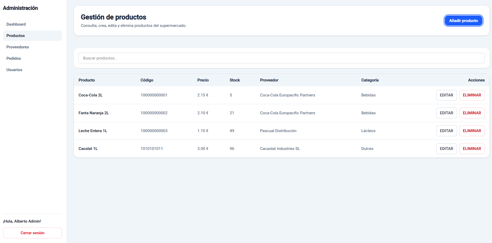

---

## Añadir producto

Formulario de creación de nuevos productos.

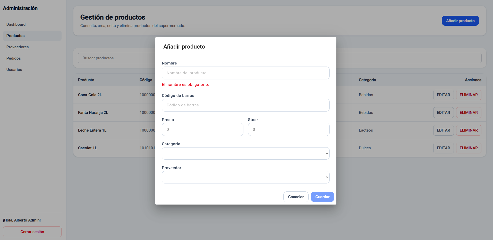

---

## Gestión de proveedores

Listado de proveedores disponibles.

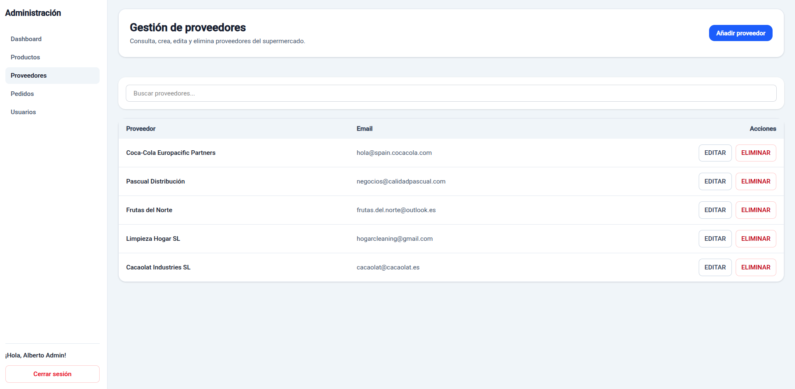

---

## Añadir proveedor

Formulario para registrar proveedores.

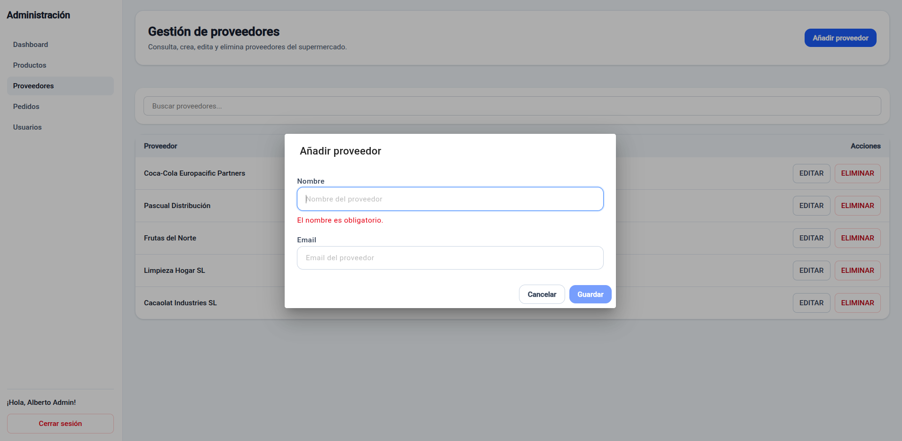

---

## Gestión de usuarios

Administración de usuarios y roles del sistema.

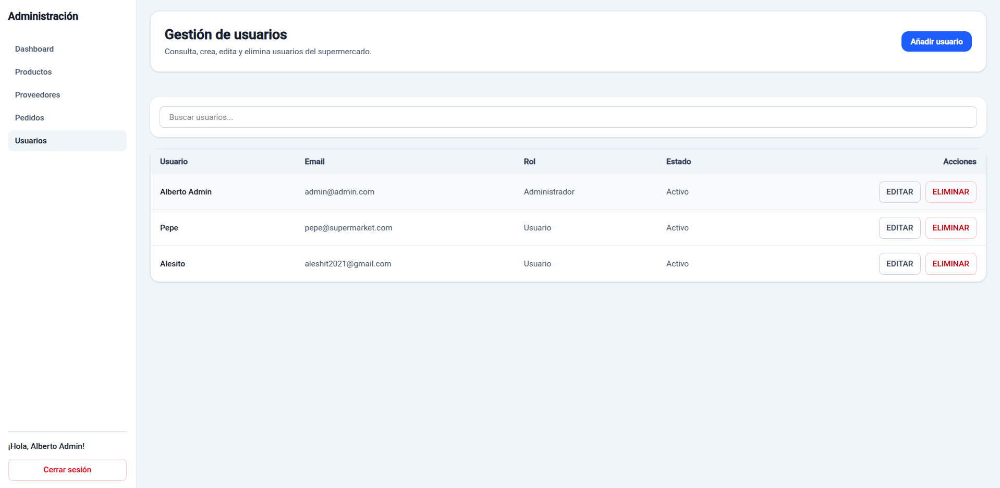

---

## Añadir usuario

Formulario de creación de usuarios.

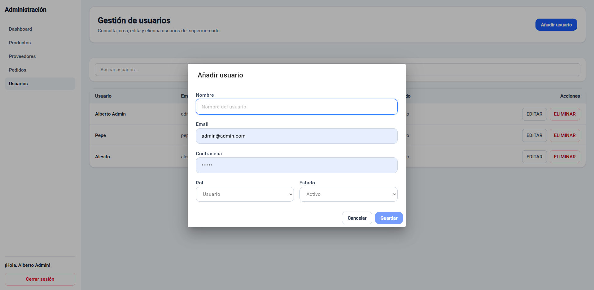

---

## Gestión de pedidos

Listado y administración de pedidos realizados.

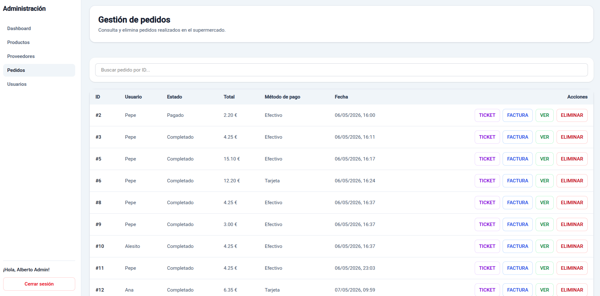

---

## Crear pedido

Interfaz de creación y gestión de pedidos.

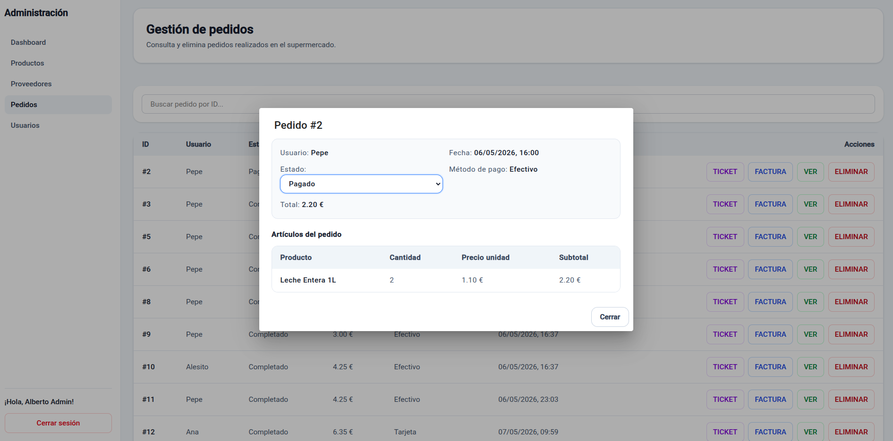

---

## TPV (Terminal Punto de Venta)

Pantalla principal utilizada por el cajero para gestionar ventas.

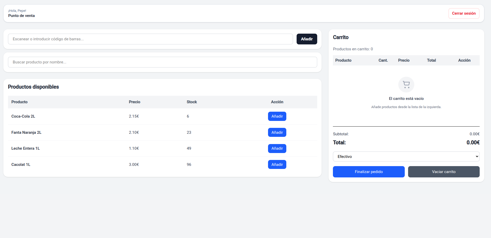

---

## Ticket de compra

Generación del ticket asociado a una venta realizada.

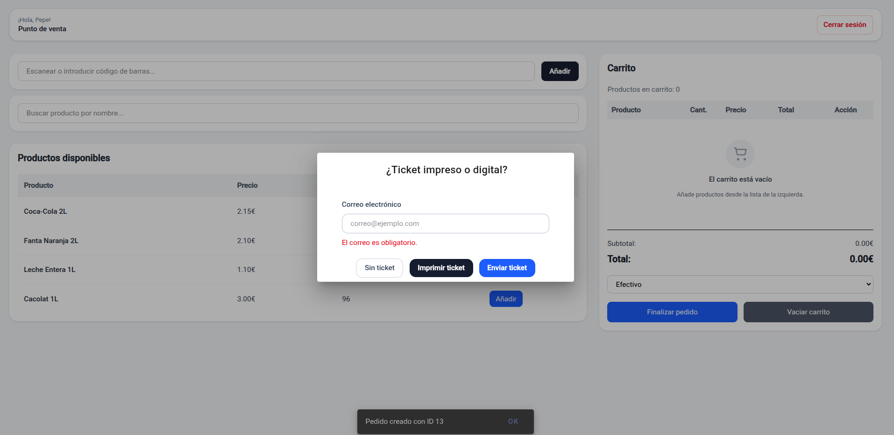